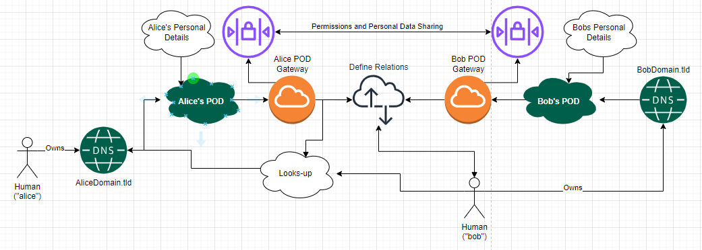
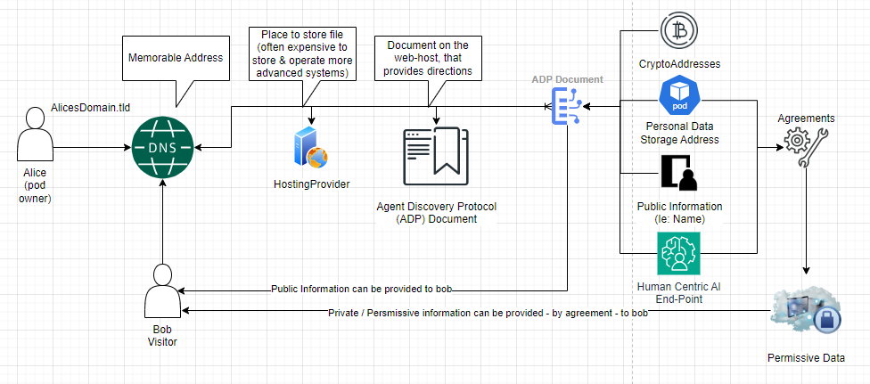

# Open Letter re: Objectives

This document attempts to provide an outline of the intended goals and considerations related to the notion of an 'agent discovery protocol' and a 'personal domain profile' framework therein.

The names  'agent discovery protocol' and 'personal domain profile' are considered 'placeholders', whereas the final names are to be considered at a later date.

The purpose of writing this document, is to seek out considerations that could be made by experts to assist with the design of a solution to address the underlying purposes of the work.  There are various specialist skills and expertise, held by some, sought to be encouraged to provide input.




OUTCOMES:

There are two intended outcomes,

1. IETF:  work hopes to discover and then produce IETF RFC(s) to support the derivatives, where appropriate. This may also include IANA considerations.
2. W3C: the work hopes to be progressed via W3C 'human centric ai' works, where appropriate.

THIS WORK IS BEING DONE FOR THE BETTERMENT OF HUMANITY. 

## ADP Introduction
The notion of an Agent Discovery Protocol, seeks to provide a means to define various properties of a domain name and related services, using Semantic Web components such as RDF.  Generally, as is defined in `rdf:foaf` there are different classes of agents, such as legal personalities, software and/or natural persons.  ADP seeks to provide solutions to problems that relate to all groups, but, there are specific considerations relating to `natural persons` that are now therefore firstly discussed.

#### Personal Domains - names
Two ideas for names have developed, although more consideration (and more names) sought.
1. Personal Intelligent Domains (PID): PID is a term used for many existing purposes, which is not considered ideal. nonetheless, the notion of an 'intelligent domain', is thought interesting.
2. Personal Domain Profile (PDP): The notion of a 'PDP' is interesting as a way to classify categories of domain use, as is otherwise considered more broadly in ADP considerations.

Both terms consider various notions related to a future 'human centric internet' and/or 'intelligent internet' and in-turn also, 'human centric ai'.  Whilst not merely defined by the domain name (or DNS); consideration about stepping stones, that better support the means for lay-persons to grok the notions, is considered helpfully beneficial.  Indeed, a 'personal intelligent domain profile' (PIDP) could be another enumerated term...  





#### General Function

1. user owns a domain
   A User may be any form of agent, product or service. 
   
   Specific considerations are made for Natural Persons.
   The Natural Person would be required to purchase a domain name on behalf of themselves or their `family unit`.  In a `family unit`, `family members` may be represented as `subdomains`, whereby the consideration is made particularly in relation to children.  
   
2. User requires a basic hosting service
   The specification is seeking to define a solution whereby the `basic:requirements` are as practically nominal as possible.  thereby, seeking to ensure solution is able to work on low-cost shared hosting services.  Often these services support `PHP` with limited support for `nodejs`.  Services most-often also support `letsencrypt` and have `LAMP` supports (php, mysql)

NOTION:  DNS RECORD (TLSA / DNSSEC SUPPORT?)

```
DNS TXT record _adp.example.com  TXT  "adp:signer <https://example.com/profile#me> ."
```

NOTE: There are existing works on WebID-RSA and WebID-TLS.  

The question is: how to create a security fabric to ensure the record is reliably provided, and security measures are employed to protect against attackers who may seek to provide alternative information, than what is in the record.

RELATED CONSIDERATION:  Could or Should users then also define subdomains / access, to their own devices and if so, how could (or should) this be implemented; noting, a device is not a person.

3. Public Secure RDF document
   The foundational tool provided by ADP is a public RDF document that provides 'routing' information, providing discovery of `user` related information, in a manner that is able to be cryptographically proven to be the correct information in the document, as intended to be provided by the user.  

NOTION:  TLS Certificate

The URI of the document could be provided in the TLS certificate (`SAN`) associated to `https` service of the domain / subdomain.  This is similar to the webid-tls method, however it does not secure the document itself.  Noting also, that the purpose of this document is considered to be different to a `foaf:profile` document, whilst constituency semantics may be included in the document or refer to the document (if sought to be private) via a `pod` service. 

the notion of using a checksum approach has been considered... 

```js
function calculateChecksum($filePath, $hashAlgorithm = 'sha256') {
    $fileContents = file_get_contents($filePath);
    if ($fileContents) {
        return hash($hashAlgorithm, $fileContents);
    } else {
        return false; // Or throw an exception if you prefer
    }
}

// Example Usage
$jsonLdChecksum = calculateChecksum('my_jsonld_file.json');
$ttlChecksum = calculateChecksum('my_turtle_file.ttl');

echo "JSON-LD Checksum (SHA-256): " . $jsonLdChecksum . "\n";
echo "Turtle Checksum (SHA-256): " . $ttlChecksum . "\n";
```

4. NOT PRIVATE - not really 'foaf'
   In the current embodiment, the ADP protocol is NOT intended to support private information.
   
   Rather, the means to identify the address of services that support permissive interactions is intended to be provided by the ADP protocol.  
   
   It is also thought not really the same as `webid` or `foaf`, whilst providing a 'bridge' to the location where that record is otherwise stored (ie: in their pod, accessible subject to permissions); however, for public entities (legal personalities, software, products, etc.) this type of information MAY be provided in the record.

   A simple example would be the ability to provide cryptocurrency addresses; for example,

```turtle
@prefix schema: <https://schema.org/> .
@prefix adp: <http://adp.tld/vocab#> .

<https://example.com/user123> adp:haseCashAddress "ecash:qrhrfvpm9x3tsq0uj09pzrfcc495h55clswp7tjp9c" .
```

5. NOT (presently) Authentication
   The purpose of ADP is presently focused on discovery rather than `AUTH`.  
   
   The consideration is that people may own their own `domainName` but not have the funds to support ownership (management, support, operation) of more complex systems personally. As such, they are most likely to employ one or more services to provide capacities externally. 

6. Personal 'social web' considerations.
   Whilst the intended purpose IS NOT Authentication or providing private services, there is a 'gotcha' use-case, which relates to the use of `socialweb` services that are often limited by `cors-policies` that can be mitigated using a `proxy` service. This is similar and may be extended by `vpn` related services (ie: `wireguard`, `openssl`, `ssh`)  
   
   NOTE: a project to design a web-extension for web-browsers to incorporate `social web` functionality is underway.  This may in-future become something that is incorporated into web-browser products and/or operating systems; thereby also, advancing to improve supports for `human centric ai` `personalAI` `agents`, that require further supports.  Whilst there are historical examples of `rdfjs` related `rww` apps, that function semantically and locally, these are now broken due to changes in the way `cors` has been made to operate, generally.  As such, newer 'app' providers now create server-side apps (mostly via `nodejs`) which MAY NOT lead to the security and privacy related outcomes sought by some `social web` advocates.
   
   Therefore, the potential to define a relatively simple `cors proxy` is thought perhaps useful.

```php
<?php

// Enable CORS (adjust the allowed origin if needed)
header('Access-Control-Allow-Origin: *');
header('Access-Control-Allow-Headers: Origin, X-Requested-With, Content-Type, Accept');

// Replace with the actual URL of your POD service
$podServiceUrl = 'https://your-pod-service.com';

// Get the requested path from the original request
$requestedPath = $_SERVER['REQUEST_URI'];

// Construct the full URL to be forwarded to the POD service
$podRequestUrl = $podServiceUrl . $requestedPath;

// Use cURL to forward the request
$ch = curl_init();
curl_setopt($ch, CURLOPT_URL, $podRequestUrl);
curl_setopt($ch, CURLOPT_RETURNTRANSFER, true);
curl_setopt($ch, CURLOPT_FOLLOWLOCATION, true); // Follow any redirects

$podResponse = curl_exec($ch);
curl_close($ch);

// Send the response back to the client
echo $podResponse;
?>
```


## Broader Considerations

##### General Considerations

There are special provisions thought necessary to support `personal domains` and related `domain services`.  For `personal domains` there is a desire to provide limited `public` information, whilst thereby depending upon permissive `data services` such as those provided by `personal data service` (`pod') providers ('pod providers')`.  As such, the `adp:` protocol is not intended to be a replacement for a `pod` rather, a complimentary `discovery` component, that provides the means for a user to simply share their `domain name` as to then support the means to identify public information (ie: a cryptocurrency accounts public key) or the `serviceURI` for engaging in agreements to support `permissive data` access and related `socialweb` services.

There are various different types of `pod providers` and many do not presently use the term `pod`. 

For broad-ranging reasons, whilst beyond the scope of these works generally otherwise, there is a need to establish a `baseline` standard for `portability` and `interoperability` purposes. It is thought that the effort that is most likely to lead to a suitable format for this requirement is likely to be `w3c solid` specifications, alongside supports for other w3c components, including but not limited to `html`, `css`, `js`, `rdf`, `credentials`, `did`, `webid`, etc.  

##### Potential Impact on Email Services
Where users are able to make use of a domain, rather than merely otherwise an email alias or address on a domain; the means for users to define `semantic links` and associate specified email aliases to represent that relationship, is considered to be a useful opportunity to improve security.

These capacities are thought to be an extension of `pod` related services, as is associated to `social web` semantics generally; enabling people, to have meaningful relationships with one-another without necessarily requiring an `intermediatory` `platform provider`.  

##### N3(TTL) vs. Json / Json-LD dichotomy

There's various serialization methods for RDF, which are largely interchangeable.  One serialization can be converted to another; but, documents and specifications generally apply definitions relating to only some.  Historically, `xml` related serialization methods (ie: `rdfa`) were preferentially employed.  More recently however, due to the growth of `json`, the `json-ld` serialization method has been preferentially employed.  the history of semantic web, is old. indeed, whilst earlier records are thought to exist; [Tim Berners-Lee: The Future of the Web (WWW94) ](https://www.youtube.com/watch?v=UkjyCPuTKPw) is one example, many years prior to the advancement of works in the later 90s.  TimBLs works included efforts to define a particular serialization method called Notation3 (`n3`), whereby a subset is defined as Turtle (`ttl`).  

Json / Json-ld services, are commonly used by systems that have a more commercial, more 'web payments' related focus.   It seems most likely that json / json-ld will continue to be the default for structured data both on the web, and many internet related services.  There are also efforts to produce [CBOR-LD](https://lists.w3.org/Archives/Public/public-json-ld-wg/2020Jul/0004.html) to address file size issues.

However, there is potentially an argument that could be made to seek to employ `n3` or `ttl` for network level purposes...  this in-turn, seeks to create a distinction that can be clearly identified due to the serialization method used for the documents.  

## Other Use-Cases

### Use of Verifiable Credentials (VCs)

Verifiable Credentials have initially been defined via W3C Web-Payments, followed by the [establishment of a W3C Credentials CG](https://www.w3.org/community/credentials/2014/08/06/call-for-participation-in-credentials-community-group/) that has since developed. 
See: [W3C Credentials](https://www.w3.org/community/credentials/)

There are various works, including within the IETF (see: [tigress](https://datatracker.ietf.org/group/tigress/about/) & [spice](https://datatracker.ietf.org/group/spice/about/) ) to advance it.  

NOTE: VCs are generally described as to be defined in `JSON-LD` or `JSON`, however the general methodology SHOULD be extensible to other RDF serialization formats, notwithstanding potential compatibility issues and in-turn also, lack of appropriate tools. 

Verifiable Claims can provide additional semantics in relation to the intended purposes of `ADP`.
#### Control over Personal Data Storage 
As is somewhat noted above; but now also broadened, the belief is that `pods` could issue a `VC` that could be used in the `adp:profile` document for persons, to validate the relationship between the `pod` and the `domainOwner`. The `pod` thereby providing more complex semantics in relation to both permissive and private data usage. 
#### Verifying Essential Services 
The notion of a `humanitarianICTService` is considered, whereby the `ADP` file could contain a `VerifiableCredential` (`VC`) issued by bodies like the UN could unambiguously identify humanitarian aid organizations or critical infrastructure providers, ensuring discoverability and facilitating appropriate treatment of their services.  

This is considered to be particularly helpful in circumstances where there are bandwidth limitations and there is consequentially a need to prioritise services; or, in circumstances that may relate to international humanitarian law (IHL) where internet services are interrupted or downgraded and may even be 'turned off' entirely, should a means to distinguish a service class that must be left on, not be available to a service provider.

```turtle
@prefix schema: <https://schema.org/> .
@prefix dct: <http://purl.org/dc/terms/> . 
@prefix foaf: <http://xmlns.com/foaf/0.1/> .
@prefix vcard: <http://www.w3.org/2006/vcard/ns#> . 
@prefix adp: <http://adp.tld/vocab#> . 
@prefix un: <https://metadata.un.org/gdc#> .

# The Organization
<https://humanitarian-aid.org> a schema:NGO, hserv:HumanitarianService ;
    vcard:organization-name "Humanitarian Aid Organization" ;
    foaf:page <https://humanitarian-aid.org>;
    adp:serviceType un:EmergencyResponse ;
    adp:hasCredential <https://gdc.un.org/credentials/12345> .
    adp:sha256 "the-sha256-hash-value-goes-here" . 

The Credential
<https://gdc.un.org/credentials/12345> a un:humanitarianICTCredential ; 
  dct:issuedBy <https://gdc.un.org/> ;
  dct:title "Humanitarian Service Verification" ;
  dct:issued "2023-11-28"^^xsd:date ;
  dct:description "A credential verifying an organization as a legitimate humanitarian service provider." .

```
#### Combating Website Impersonation: 
VCs tied to domain ownership and issued by regulatory bodies can help distinguish legitimate websites (banks, government services) from fraudulent impersonators.  As the method is intended to be provided in relation to DNS services, the means to distinguish links in email documents and otherwise is thought to be beneficially empowered through the application of an ADP like solution.
#### Defining Software Agents

ADP could be used to define a software agent, merely by the domain or URI. 

##### AI Service
```turtle
@prefix adp: <http://www.example.org/adp#> .
@prefix ai: <http://www.example.org/ai-ontology#> .

<#this>
    a adp:Agent, ai:TextSummarizer ;
    adp:dnsDomain "ai-service.com" ;
    ai:capability ai:Summarization ;
    ai:inputFormat <https://schema.org/Text> ;
    adp:serviceEndpoint <https://ai-service.com/api>.

```

##### SparqlEndpoint

```turtle
<http://example.com/sparql-service> a schema:WebAPI ; 
    schema:description "SPARQL service for humanitarian data" ;
    schema:url <http://example.com/sparql> .

```

### Addressbook support

```turtle
@prefix schema: <https://schema.org/> .
@prefix vcard: <http://www.w3.org/2006/vcard/ns#> .
@prefix org: <http://www.w3.org/ns/org#> .

<https://www.google.com/> a schema:Corporation ;
    vcard:organization-name "Google" ;
    org:hasMember <https://www.google.com/search> , 
                   <https://ads.google.com> ,
                   <https://www.youtube.com> , 
                   <https://cloud.google.com> . # Add more as needed

<https://www.google.com/search> a schema:WebSite ;
    schema:name "Google Search" .

<https://ads.google.com> a schema:Service ;
    schema:name "Google Ads" . 

<https://www.youtube.com> a schema:VideoObject ; 
    schema:name "YouTube" .

<https://cloud.google.com> a schema:SoftwareApplication ;
    schema:name "Google Cloud Platform" .    

```
##### Cookies
It is desirable to consider how ADP could be used to define 'agreements' in relation to the creation, storage and use of cookies.  This would require the web-browser to have 'social web' extensions enabled (linked to a POD) and the means to provide public information, that is then able to be associated to a web-service to define the agreement between the service provider and the user about what information may be stored in relation to the use of cookies.

#### Reliable Age-Appropriate Content 
Historical means to distinguish whether websites are appropriate for children or otherwise has been haphazard.  VCs could attest to age-related content ratings, providing a robust mechanism for content providers to declare classifications and for users or parental control systems to enforce restrictions.  Yet also, with extended 'social web' supports, the means to alter the way web-services are provided on the basis of `age-range` is also something that could be considered.

```turtle
@prefix schema: <https://schema.org/> .

<https://example-adult-website.com> a schema:WebSite ;
     schema:isAdultOriented "True" .

# or 

@prefix acme: <http://acme.org/ratings#> .

<https://example-adult-website.com> a schema:WebSite ;
     acme:contentRating "ACME-18+" .

```

Therein, conceptually, the means to curate what content is available to users based upon 'age appropriate' considerations.

```turtle
@prefix schema: <https://schema.org/> .
@prefix content: <http://example.org/content#> 
@prefix adp: <http://example.com/api#> .

# The Video Website
<https://mediaservice.tld> a schema:WebSite ;
    adp:hasEndpoint adp:childEndpoint, adp:teenEndpoint, adp:adultEndpoint .

# Child Endpoint
adp:childEndpoint a schema:EntryPoint ;
    content:suitableForAgeGroup "Under13" . 

# Teen Endpoint
adp:teenEndpoint a schema:EntryPoint ;
    content:suitableForAgeGroup "13to18" .

# Adult Endpoint
adp:adultEndpoint a schema:EntryPoint ; 
    content:suitableForAgeGroup "Over18" .

```

NOTE: Some of these use-cases require 'social web' functionality supports via methods and systems that are not intended to be solely provided via ADP, but is thought to require it.

#### ADP Document generally.
The ADP Document (ie: `domain.tld/.wellknown/adp.n3` or `domain.tld/adp.n3`) is intended to provide, in RDF, what is in-effect a public graph.  The use for individuals is considered to be different to the use-cases for other agents.  


## Foundational Questions

What is the best method to;
a. secure the document (ie: checksum?)
b. bond the document to the domain cryptographically
c. are there any other MAJOR considerations I may have missed?

It is assumed that the document URI will be provided in the TLS certificate as a SAN.

## Other notes
Examples provided in this document are illustrative only, the specifics have not been considered properly, yet.  